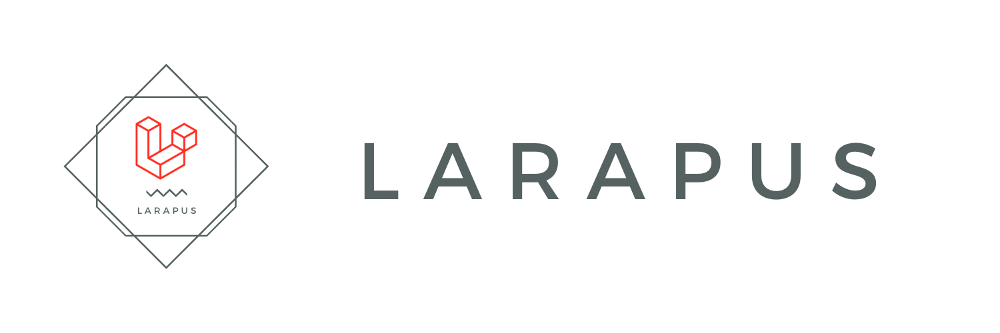

## About Larapus

Larapus is a library management system built with Laravel 7

## Features

- User management (Admin, Librarian, and Member).
- Book management stock.
- Bookshelf.
- Search Book.
- Book List (On progress).
- Penalty (On progress).
- Report (On progress).

## Contributing

Thank you for considering contributing to the Larapus application!. If you found some error, please submit to the issue list.

## License

The Laravel framework is open-sourced software licensed under the [MIT license](https://opensource.org/licenses/MIT).

Copyright 2013-2020 Start Bootstrap LLC. Code released under the [MIT](https://github.com/StartBootstrap/startbootstrap-resume/blob/gh-pages/LICENSE) license.